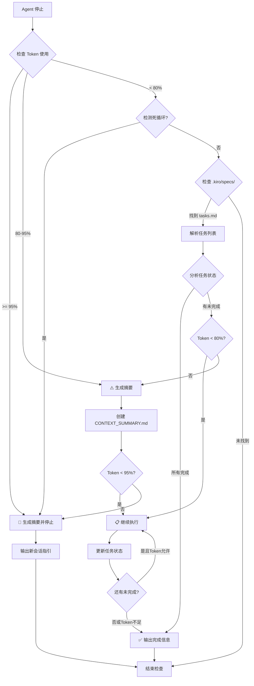

# Kiro Hooks 说明文档

## 概述

本目录包含自动化 agent 行为的 Hooks 配置。Hooks 允许在特定事件发生时自动触发 agent 操作。

## 已配置的 Hooks

### 1. 自动继续未完成任务 (auto-continue-tasks)

**文件**: `verify-task-completion.kiro.hook`

**触发时机**: Agent 停止时 (`agentStop`)

**版本**: v3.0

**功能描述**:
智能检查当前 spec 中的任务完成状态，自动管理上下文使用，避免死循环，确保任务高效完成。

#### 工作流程



#### 关键特性

1. **智能上下文管理** 🧠
   - 实时监控 token 使用率
   - Token < 80%：正常执行
   - Token 80-95%：生成摘要后继续
   - Token >= 95%：停止并指引新会话
   - 自动创建 `CONTEXT_SUMMARY.md` 文件

2. **死循环防护** 🔄
   - 检测最近 3 次消息是否都由 Hook 触发
   - 自动识别循环模式
   - 立即停止并输出警告
   - 避免无限递归

3. **自动化执行** 🚀
   - 不询问用户确认
   - 不等待用户输入
   - 智能决策何时继续/停止
   - 自动继续直到任务完成或上下文限制

4. **进度跟踪** 📊
   - 实时显示任务完成进度
   - 显示 token 使用情况
   - 列出接下来要执行的任务
   - 自动更新 tasks.md 中的状态标记

5. **错误处理** ⚠️
   - 遇到错误时报告但不停止（token 允许时）
   - 尝试继续执行下一个任务
   - 确保最大程度完成工作
   - 在上下文不足时优雅停止

#### 配置参数

```json
{
  "enabled": true,              // 启用/禁用 Hook
  "name": "自动继续未完成任务",  // Hook 显示名称
  "version": "3.0",             // 版本号
  "when": {
    "type": "agentStop"         // 触发事件类型
  },
  "then": {
    "type": "askAgent",         // 执行动作类型
    "prompt": "..."             // 发送给 agent 的提示
  }
}
```

#### Token 使用阈值

- **< 80% (< 160K/200K)**: 绿色区域 - 正常执行
- **80-95% (160K-190K)**: 黄色区域 - 生成摘要后继续
- **>= 95% (>= 190K)**: 红色区域 - 停止并指引新会话

#### 使用场景

**场景 1: 长时间运行的 Spec 实现**
- 用户启动 spec 任务执行
- Agent 执行部分任务后因某种原因停止
- Hook 自动检测并继续执行剩余任务
- 无需用户手动重启

**场景 2: 上下文接近限制 (80-95%)**
- Agent 执行了大量任务，token 使用达到 85%
- Hook 检测到上下文压力
- 自动生成 `CONTEXT_SUMMARY.md` 摘要文件
- 使用压缩后的上下文继续执行
- 避免上下文溢出

**场景 3: 上下文已满 (>= 95%)**
- Token 使用达到 95% 或更高
- Hook 生成详细的上下文摘要
- 停止当前会话执行
- 输出清晰的新会话指引
- 用户在新会话中继续，参考摘要文件

**场景 4: 批量任务执行**
- Spec 包含 50+ 个子任务
- Agent 逐个执行任务
- 每次停止时 Hook 自动检查并继续
- 智能管理 token 使用
- 确保所有任务最终完成

**场景 5: 死循环检测**
- Hook 连续触发 3 次
- 自动识别循环模式
- 立即停止执行
- 生成摘要并输出警告
- 避免无限递归消耗资源

#### 任务状态格式

Hook 识别以下 Markdown 任务格式：

```markdown
- [ ] 未完成的任务
- [x] 已完成的任务
- [ ] 父任务
  - [x] 子任务 1
  - [ ] 子任务 2
```

#### 输出示例

**所有任务已完成时**:
```
✅ 所有任务已完成（67/67）
Spec: database-advanced-features 已全部完成！
```

**存在未完成任务 (Token < 80%)**:
```
📊 Spec 任务状态检查
━━━━━━━━━━━━━━━━━━━━━━━━━━━━━━━━━━
Spec: database-advanced-features
进度: [3/67] 任务已完成
Token 使用: 45K/200K (22.5%)

接下来执行：
  [ ] 4.1 - 创建SQLEditor组件基础结构

🚀 继续执行...
```

**上下文接近限制 (Token 80-95%)**:
```
⚠️ 上下文接近限制
━━━━━━━━━━━━━━━━━━━━━━━━━━━━━━━━━━
Spec: database-advanced-features
进度: [35/67] 任务已完成
Token 使用: 170K/200K (85%)

📝 生成上下文摘要...
✅ 摘要已保存：.kiro/specs/database-advanced-features/CONTEXT_SUMMARY.md

接下来执行：
  [ ] 11.3 - 实现修改指示器和批量保存

🚀 继续执行（使用压缩上下文）...
```

**上下文已满 (Token >= 95%)**:
```
🛑 上下文已满，需要新会话
━━━━━━━━━━━━━━━━━━━━━━━━━━━━━━━━━━
Spec: database-advanced-features
进度: [55/67] 任务已完成
Token 使用: 192K/200K (96%)

✅ 已生成上下文摘要：.kiro/specs/database-advanced-features/CONTEXT_SUMMARY.md

📌 请在新会话中继续：
1. 打开新的 Kiro 会话
2. 发送消息："继续执行 database-advanced-features 的剩余任务，从任务 16.2 开始"
3. 参考摘要文件了解已完成的工作

未完成任务：
  [ ] 16.2 - 实现查询取消功能
  [ ] 16.3 - 实现数据验证错误显示
  [ ] 16.4 - 实现DDL执行错误处理
  ...（还有 12 个任务）
```

**检测到死循环**:
```
🔄 检测到循环执行
━━━━━━━━━━━━━━━━━━━━━━━━━━━━━━━━━━
最近 3 次执行都由 Hook 触发，可能陷入循环。

✅ 已生成上下文摘要：.kiro/specs/database-advanced-features/CONTEXT_SUMMARY.md

⚠️ 请手动检查问题并在新会话中继续。
可能的原因：
- 任务执行失败但未更新状态
- Hook 配置错误
- 系统资源不足
```

## Hook 管理

### 启用/禁用 Hook

修改 Hook 文件中的 `enabled` 字段：

```json
{
  "enabled": false  // 禁用 Hook
}
```

### 查看 Hook 状态

在 Kiro IDE 中：
1. 打开命令面板 (Ctrl+Shift+P)
2. 搜索 "Open Kiro Hook UI"
3. 查看所有 Hooks 的状态

或者在 Explorer 视图中查看 "Agent Hooks" 部分。

### 调试 Hook

如果 Hook 没有按预期工作：

1. **检查 Hook 文件语法**
   - 确保 JSON 格式正确
   - 验证所有必需字段存在

2. **查看 Agent 日志**
   - Hook 触发时会在日志中显示
   - 检查是否有错误消息

3. **测试 Hook 提示**
   - 手动复制 Hook 的 prompt
   - 直接发送给 agent 测试
   - 验证 agent 响应是否正确

## 最佳实践

### 1. 保持 Prompt 清晰

- 使用结构化的提示格式
- 明确指定执行步骤
- 包含决策逻辑和特殊规则

### 2. 避免无限循环

- 确保 Hook 有明确的终止条件
- 在 prompt 中包含"如果没有任务则结束"的逻辑
- 监控 Hook 执行次数

### 3. 上下文管理

- 定期检查会话历史大小
- 在必要时压缩上下文
- 只保留与当前任务相关的信息

### 4. 错误处理

- 在 prompt 中包含错误处理指令
- 允许 agent 在遇到错误时继续
- 记录错误但不停止整个流程

## 创建新 Hook

### 步骤

1. 在 `.kiro/hooks/` 目录创建新文件
2. 文件名格式：`<hook-name>.kiro.hook`
3. 使用以下模板：

```json
{
  "enabled": true,
  "name": "Hook 显示名称",
  "description": "Hook 功能描述",
  "version": "1.0",
  "when": {
    "type": "agentStop"  // 或其他事件类型
  },
  "then": {
    "type": "askAgent",  // 或 "runCommand"
    "prompt": "发送给 agent 的详细指令"
  },
  "workspaceFolderName": "bun-db-tool",
  "shortName": "hook-short-name"
}
```

### 可用事件类型

- `agentStop`: Agent 执行停止时
- `promptSubmit`: 用户提交消息时
- `fileEdited`: 文件被编辑时
- `fileCreated`: 文件被创建时
- `fileDeleted`: 文件被删除时
- `userTriggered`: 用户手动触发时

### 可用动作类型

- `askAgent`: 发送消息给 agent
- `runCommand`: 执行 shell 命令（仅适用于 `promptSubmit` 和 `agentStop`）

## 故障排除

### Hook 没有触发

**可能原因**:
- Hook 被禁用 (`enabled: false`)
- 事件类型不匹配
- JSON 格式错误

**解决方案**:
1. 检查 `enabled` 字段
2. 验证 `when.type` 是否正确
3. 使用 JSON 验证器检查语法

### Hook 触发但没有执行预期操作

**可能原因**:
- Prompt 不够清晰
- Agent 理解有误
- 缺少必要的上下文

**解决方案**:
1. 优化 prompt，使其更具体
2. 添加更多执行步骤说明
3. 包含示例输出格式

### 会话历史过长导致性能问题

**解决方案**:
- 在 Hook prompt 中添加上下文压缩逻辑
- 定期清理不相关的历史信息
- 使用摘要代替完整历史

## 相关资源

- [Kiro Hooks 官方文档](https://docs.kiro.ai/hooks)
- [Spec 任务管理指南](../.kiro/specs/README.md)
- [Agent 最佳实践](https://docs.kiro.ai/best-practices)

## 上下文摘要文件

当 token 使用超过 80% 时，Hook 会自动生成 `CONTEXT_SUMMARY.md` 文件：

**位置**: `.kiro/specs/[spec-name]/CONTEXT_SUMMARY.md`

**内容结构**:
```markdown
# [Spec 名称] - 上下文摘要

**生成时间**: 2026-02-10 15:30:00
**进度**: 35/67 任务已完成
**Token 使用**: 170K/200K (85%)

## Spec 目标
实现数据库高级功能，包括 SQL 编辑器、表设计器和数据编辑功能。

## 已完成任务
- [x] 1. 设置项目基础结构和类型定义
- [x] 2.1-2.7 实现后端SQL执行服务
- [x] 3.1-3.3 实现前端SQL编辑器Store
...

## 当前任务
[ ] 11.3 实现修改指示器和批量保存
- 在修改的行首显示指示器
- 实现"保存更改"按钮
- 调用Transaction Manager批量保存

## 未完成任务
[ ] 11.4 实现添加和删除行功能
[ ] 11.5 编写INSERT语句生成的属性测试
...

## 关键文件
- `frontend/src/stores/sql-editor.ts` - SQL编辑器状态管理
- `src-tauri/src/services/query_executor.rs` - 查询执行服务
- `frontend/src/components/database/DataGrid.vue` - 数据网格组件

## 重要决策和注意事项
1. 使用 Monaco Editor 作为 SQL 编辑器
2. 所有数据修改操作在事务中执行
3. 使用虚拟滚动处理大数据集

## 下一步行动
继续执行任务 11.3：实现修改指示器和批量保存
```

## 更新日志

### v3.0 (2026-02-10)
- 🆕 添加智能 token 使用监控（80%、95% 阈值）
- 🆕 实现死循环检测机制
- 🆕 自动生成 CONTEXT_SUMMARY.md 文件
- 🆕 新会话指引功能
- ✨ 改进决策逻辑（5 种情况处理）
- ✨ 增强输出格式和用户体验

### v2.0 (2026-02-10)
- 增强任务状态检查逻辑
- 添加智能上下文管理
- 改进进度显示格式
- 添加错误处理机制

### v1.0 (初始版本)
- 基本任务完成状态检查
- 自动继续执行功能
