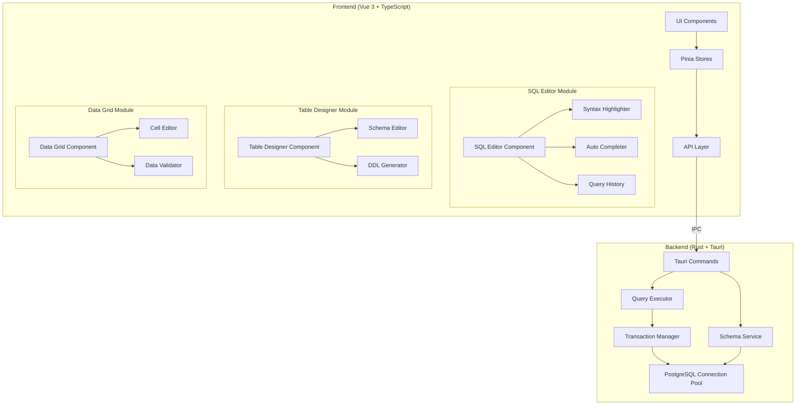
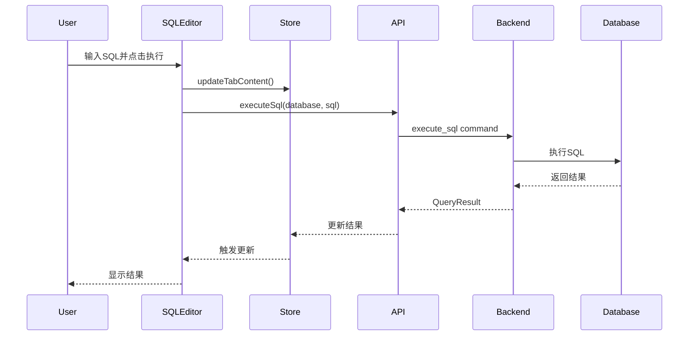
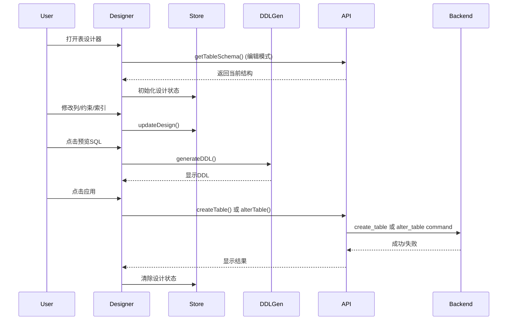
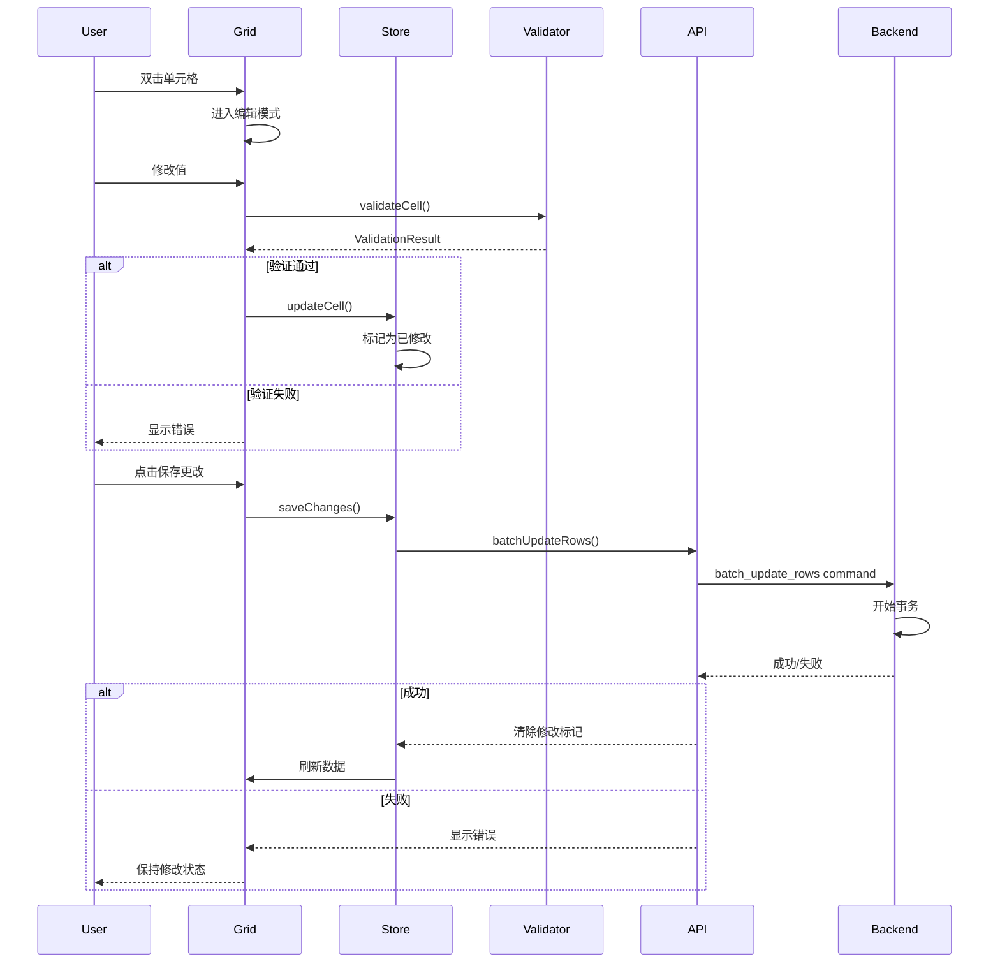

# Design Document: Database Advanced Features

## Overview

本设计文档描述了为现有数据库资源管理器添加SQL执行、表设计和数据编辑功能的技术实现方案。该功能将采用Vue 3组件化架构，通过Tauri IPC与Rust后端通信，提供类似VSCode数据库插件的用户体验。

核心设计原则：
- **组件化**：将功能拆分为可复用的Vue组件
- **响应式**：使用Pinia状态管理确保数据一致性
- **性能优化**：虚拟滚动、异步加载、批处理
- **用户体验**：参考VSCode SQLTools插件的交互模式

## Architecture

### 系统架构图



### 架构层次

1. **表现层（Presentation Layer）**
   - Vue 3组件：SQL编辑器、表设计器、数据网格
   - Naive UI组件库：提供基础UI组件
   - Monaco Editor：提供代码编辑能力

2. **状态管理层（State Management Layer）**
   - Pinia Store：管理应用状态
   - 查询历史Store：管理历史查询
   - 编辑器状态Store：管理编辑器状态和标签页

3. **API层（API Layer）**
   - 统一的Tauri命令调用接口
   - 错误处理和响应转换
   - 类型安全的API定义

4. **后端服务层（Backend Service Layer）**
   - Query Executor：执行SQL语句
   - Schema Service：管理表结构
   - Transaction Manager：管理数据库事务
   - Connection Pool：管理数据库连接

## Components and Interfaces

### Frontend Components

#### 1. SQLEditor Component

**职责**：提供SQL代码编辑和执行功能

**Props**：
```typescript
interface SQLEditorProps {
  initialContent?: string;
  database?: string;
  readOnly?: boolean;
}
```

**Events**：
```typescript
interface SQLEditorEvents {
  onExecute: (sql: string) => void;
  onContentChange: (content: string) => void;
}
```

**主要功能**：
- 集成Monaco Editor提供代码编辑
- SQL语法高亮
- 自动完成（关键字、表名、列名）
- 执行选中或全部SQL
- 显示执行结果

**子组件**：
- `ResultPanel`：显示查询结果
- `QueryHistoryPanel`：显示查询历史
- `EditorToolbar`：编辑器工具栏

#### 2. TableDesigner Component

**职责**：提供可视化表结构设计功能

**Props**：
```typescript
interface TableDesignerProps {
  mode: 'create' | 'edit';
  database: string;
  schema?: string;
  tableName?: string;
}
```

**State**：
```typescript
interface TableDesignState {
  tableName: string;
  schema: string;
  columns: ColumnDefinition[];
  constraints: ConstraintDefinition[];
  indexes: IndexDefinition[];
  isDirty: boolean;
}

interface ColumnDefinition {
  name: string;
  type: string;
  length?: number;
  precision?: number;
  scale?: number;
  nullable: boolean;
  defaultValue?: string;
  isPrimaryKey: boolean;
  isUnique: boolean;
  comment?: string;
}

interface ConstraintDefinition {
  type: 'primary_key' | 'foreign_key' | 'unique' | 'check';
  name: string;
  columns: string[];
  referencedTable?: string;
  referencedColumns?: string[];
  onDelete?: 'CASCADE' | 'SET NULL' | 'RESTRICT' | 'NO ACTION';
  onUpdate?: 'CASCADE' | 'SET NULL' | 'RESTRICT' | 'NO ACTION';
  checkExpression?: string;
}

interface IndexDefinition {
  name: string;
  columns: string[];
  type: 'btree' | 'hash' | 'gist' | 'gin';
  unique: boolean;
}
```

**主要功能**：
- 添加/编辑/删除列
- 管理约束（主键、外键、唯一、检查）
- 管理索引
- 预览生成的DDL
- 应用更改到数据库

**子组件**：
- `ColumnEditor`：列定义编辑器
- `ConstraintEditor`：约束编辑器
- `IndexEditor`：索引编辑器
- `DDLPreview`：DDL预览面板

#### 3. DataGrid Component

**职责**：显示和编辑表数据

**Props**：
```typescript
interface DataGridProps {
  columns: ColumnInfo[];
  data: Record<string, any>[];
  editable: boolean;
  primaryKeys: string[];
  totalRows: number;
  page: number;
  pageSize: number;
}
```

**State**：
```typescript
interface DataGridState {
  editingCell: { row: number; column: string } | null;
  modifiedRows: Map<number, Record<string, any>>;
  newRows: Record<string, any>[];
  deletedRows: Set<number>;
}
```

**Events**：
```typescript
interface DataGridEvents {
  onCellEdit: (row: number, column: string, value: any) => void;
  onSaveChanges: () => Promise<void>;
  onDiscardChanges: () => void;
  onAddRow: () => void;
  onDeleteRows: (rows: number[]) => void;
  onPageChange: (page: number) => void;
}
```

**主要功能**：
- 虚拟滚动支持大数据集
- 内联单元格编辑
- 批量修改跟踪
- 数据验证
- 添加/删除行

**子组件**：
- `CellEditor`：单元格编辑器（根据数据类型显示不同控件）
- `ValidationMessage`：验证错误消息
- `RowActions`：行操作按钮

### Frontend Stores

#### 1. SQL Editor Store

```typescript
interface SQLEditorStore {
  // State
  tabs: EditorTab[];
  activeTabId: string | null;
  queryHistory: QueryHistoryItem[];
  
  // Actions
  createTab(content?: string): string;
  closeTab(tabId: string): void;
  updateTabContent(tabId: string, content: string): void;
  setActiveTab(tabId: string): void;
  addToHistory(query: QueryHistoryItem): void;
  clearHistory(): void;
  getHistoryByDatabase(database: string): QueryHistoryItem[];
}

interface EditorTab {
  id: string;
  label: string;
  content: string;
  database?: string;
  result?: QueryResult;
  isExecuting: boolean;
}

interface QueryHistoryItem {
  id: string;
  query: string;
  database: string;
  executedAt: Date;
  duration: number;
  success: boolean;
  error?: string;
}

interface QueryResult {
  type: 'select' | 'dml' | 'ddl' | 'error';
  columns?: ColumnInfo[];
  rows?: Record<string, any>[];
  rowCount?: number;
  affectedRows?: number;
  duration: number;
  error?: string;
}
```

#### 2. Table Designer Store

```typescript
interface TableDesignerStore {
  // State
  isOpen: boolean;
  mode: 'create' | 'edit';
  currentDesign: TableDesignState | null;
  originalDesign: TableDesignState | null;
  
  // Actions
  openDesigner(mode: 'create' | 'edit', options?: DesignerOptions): void;
  closeDesigner(): void;
  updateDesign(design: Partial<TableDesignState>): void;
  addColumn(column: ColumnDefinition): void;
  updateColumn(index: number, column: ColumnDefinition): void;
  deleteColumn(index: number): void;
  addConstraint(constraint: ConstraintDefinition): void;
  deleteConstraint(index: number): void;
  addIndex(index: IndexDefinition): void;
  deleteIndex(index: number): void;
  generateDDL(): string;
  applyChanges(): Promise<void>;
}
```

#### 3. Data Grid Store

```typescript
interface DataGridStore {
  // State
  currentTable: {
    database: string;
    schema: string;
    table: string;
  } | null;
  columns: ColumnInfo[];
  data: Record<string, any>[];
  totalRows: number;
  page: number;
  pageSize: number;
  modifications: DataModifications;
  
  // Actions
  loadTableData(database: string, schema: string, table: string): Promise<void>;
  setPage(page: number): void;
  setPageSize(pageSize: number): void;
  updateCell(rowIndex: number, column: string, value: any): void;
  addRow(): void;
  deleteRows(rowIndexes: number[]): void;
  saveChanges(): Promise<void>;
  discardChanges(): void;
}

interface DataModifications {
  updated: Map<number, Record<string, any>>;
  inserted: Record<string, any>[];
  deleted: Set<number>;
}
```

### Backend Tauri Commands

#### 1. SQL Execution Commands

```rust
#[tauri::command]
async fn execute_sql(
    database: String,
    sql: String,
    state: State<'_, AppState>,
) -> Result<QueryResult, String> {
    // Execute SQL and return results
}

#[tauri::command]
async fn cancel_query(
    query_id: String,
    state: State<'_, AppState>,
) -> Result<(), String> {
    // Cancel running query
}
```

#### 2. Schema Management Commands

```rust
#[tauri::command]
async fn get_table_schema(
    database: String,
    schema: String,
    table: String,
    state: State<'_, AppState>,
) -> Result<TableSchema, String> {
    // Get complete table schema including columns, constraints, indexes
}

#[tauri::command]
async fn create_table(
    database: String,
    design: TableDesign,
    state: State<'_, AppState>,
) -> Result<(), String> {
    // Create new table
}

#[tauri::command]
async fn alter_table(
    database: String,
    schema: String,
    table: String,
    changes: TableChanges,
    state: State<'_, AppState>,
) -> Result<(), String> {
    // Alter existing table
}

#[tauri::command]
async fn get_database_objects(
    database: String,
    object_type: String, // "tables", "columns", "functions"
    state: State<'_, AppState>,
) -> Result<Vec<String>, String> {
    // Get database objects for auto-completion
}
```

#### 3. Data Manipulation Commands

```rust
#[tauri::command]
async fn batch_update_rows(
    database: String,
    schema: String,
    table: String,
    updates: Vec<RowUpdate>,
    state: State<'_, AppState>,
) -> Result<(), String> {
    // Update multiple rows in a transaction
}

#[tauri::command]
async fn batch_insert_rows(
    database: String,
    schema: String,
    table: String,
    rows: Vec<HashMap<String, Value>>,
    state: State<'_, AppState>,
) -> Result<(), String> {
    // Insert multiple rows in a transaction
}

#[tauri::command]
async fn batch_delete_rows(
    database: String,
    schema: String,
    table: String,
    primary_keys: Vec<HashMap<String, Value>>,
    state: State<'_, AppState>,
) -> Result<(), String> {
    // Delete multiple rows in a transaction
}
```

### Backend Data Structures

```rust
#[derive(Serialize, Deserialize)]
struct QueryResult {
    result_type: QueryResultType,
    columns: Option<Vec<ColumnInfo>>,
    rows: Option<Vec<HashMap<String, Value>>>,
    affected_rows: Option<u64>,
    duration_ms: u64,
    error: Option<String>,
}

#[derive(Serialize, Deserialize)]
enum QueryResultType {
    Select,
    Insert,
    Update,
    Delete,
    Ddl,
    Error,
}

#[derive(Serialize, Deserialize)]
struct TableSchema {
    table_name: String,
    schema: String,
    columns: Vec<ColumnDefinition>,
    constraints: Vec<ConstraintDefinition>,
    indexes: Vec<IndexDefinition>,
}

#[derive(Serialize, Deserialize)]
struct RowUpdate {
    primary_key: HashMap<String, Value>,
    changes: HashMap<String, Value>,
}
```

## Data Models

### Frontend Type Definitions

```typescript
// frontend/src/types/sql-editor.ts

export interface EditorTab {
  id: string;
  label: string;
  content: string;
  database?: string;
  result?: QueryResult;
  isExecuting: boolean;
  isDirty: boolean;
}

export interface QueryResult {
  type: 'select' | 'dml' | 'ddl' | 'error';
  columns?: ColumnInfo[];
  rows?: Record<string, any>[];
  rowCount?: number;
  affectedRows?: number;
  duration: number;
  error?: string;
  errorPosition?: { line: number; column: number };
}

export interface QueryHistoryItem {
  id: string;
  query: string;
  database: string;
  executedAt: Date;
  duration: number;
  success: boolean;
  error?: string;
}

export interface AutoCompleteItem {
  label: string;
  kind: 'keyword' | 'table' | 'column' | 'function';
  detail?: string;
  documentation?: string;
}
```

```typescript
// frontend/src/types/table-designer.ts

export interface TableDesignState {
  tableName: string;
  schema: string;
  columns: ColumnDefinition[];
  constraints: ConstraintDefinition[];
  indexes: IndexDefinition[];
  isDirty: boolean;
}

export interface ColumnDefinition {
  name: string;
  type: PostgreSQLType;
  length?: number;
  precision?: number;
  scale?: number;
  nullable: boolean;
  defaultValue?: string;
  isPrimaryKey: boolean;
  isUnique: boolean;
  comment?: string;
  isNew?: boolean;
  isModified?: boolean;
  isDeleted?: boolean;
}

export type PostgreSQLType =
  | 'INTEGER'
  | 'BIGINT'
  | 'SMALLINT'
  | 'DECIMAL'
  | 'NUMERIC'
  | 'REAL'
  | 'DOUBLE PRECISION'
  | 'VARCHAR'
  | 'CHAR'
  | 'TEXT'
  | 'BOOLEAN'
  | 'DATE'
  | 'TIME'
  | 'TIMESTAMP'
  | 'TIMESTAMPTZ'
  | 'JSON'
  | 'JSONB'
  | 'UUID'
  | 'BYTEA';

export interface ConstraintDefinition {
  type: 'primary_key' | 'foreign_key' | 'unique' | 'check';
  name: string;
  columns: string[];
  referencedTable?: string;
  referencedColumns?: string[];
  onDelete?: ReferentialAction;
  onUpdate?: ReferentialAction;
  checkExpression?: string;
  isNew?: boolean;
  isDeleted?: boolean;
}

export type ReferentialAction = 'CASCADE' | 'SET NULL' | 'RESTRICT' | 'NO ACTION';

export interface IndexDefinition {
  name: string;
  columns: string[];
  type: 'btree' | 'hash' | 'gist' | 'gin';
  unique: boolean;
  isNew?: boolean;
  isDeleted?: boolean;
}
```

```typescript
// frontend/src/types/data-grid.ts

export interface DataGridState {
  database: string;
  schema: string;
  table: string;
  columns: ColumnInfo[];
  data: Record<string, any>[];
  totalRows: number;
  page: number;
  pageSize: number;
  primaryKeys: string[];
  editable: boolean;
}

export interface CellEditState {
  rowIndex: number;
  columnName: string;
  originalValue: any;
  currentValue: any;
  isValid: boolean;
  validationError?: string;
}

export interface DataModifications {
  updated: Map<number, RowModification>;
  inserted: RowData[];
  deleted: Set<number>;
}

export interface RowModification {
  originalData: Record<string, any>;
  changes: Record<string, any>;
}

export type RowData = Record<string, any>;

export interface ValidationResult {
  isValid: boolean;
  error?: string;
}
```

### Backend Data Models

```rust
// src-tauri/src/models/query.rs

use serde::{Deserialize, Serialize};
use sqlx::postgres::PgRow;
use sqlx::Row;
use std::collections::HashMap;

#[derive(Debug, Serialize, Deserialize)]
pub struct QueryResult {
    pub result_type: QueryResultType,
    pub columns: Option<Vec<ColumnInfo>>,
    pub rows: Option<Vec<HashMap<String, serde_json::Value>>>,
    pub affected_rows: Option<u64>,
    pub duration_ms: u64,
    pub error: Option<String>,
    pub error_position: Option<ErrorPosition>,
}

#[derive(Debug, Serialize, Deserialize)]
pub enum QueryResultType {
    Select,
    Insert,
    Update,
    Delete,
    Ddl,
    Error,
}

#[derive(Debug, Serialize, Deserialize)]
pub struct ErrorPosition {
    pub line: usize,
    pub column: usize,
}

#[derive(Debug, Serialize, Deserialize, Clone)]
pub struct ColumnInfo {
    pub name: String,
    pub type_name: String,
    pub nullable: bool,
    pub is_primary_key: bool,
}
```

```rust
// src-tauri/src/models/schema.rs

use serde::{Deserialize, Serialize};

#[derive(Debug, Serialize, Deserialize)]
pub struct TableSchema {
    pub table_name: String,
    pub schema: String,
    pub columns: Vec<ColumnDefinition>,
    pub constraints: Vec<ConstraintDefinition>,
    pub indexes: Vec<IndexDefinition>,
}

#[derive(Debug, Serialize, Deserialize, Clone)]
pub struct ColumnDefinition {
    pub name: String,
    pub data_type: String,
    pub character_maximum_length: Option<i32>,
    pub numeric_precision: Option<i32>,
    pub numeric_scale: Option<i32>,
    pub is_nullable: bool,
    pub column_default: Option<String>,
    pub is_primary_key: bool,
    pub is_unique: bool,
}

#[derive(Debug, Serialize, Deserialize)]
pub struct ConstraintDefinition {
    pub constraint_type: String,
    pub constraint_name: String,
    pub columns: Vec<String>,
    pub referenced_table: Option<String>,
    pub referenced_columns: Option<Vec<String>>,
    pub on_delete: Option<String>,
    pub on_update: Option<String>,
    pub check_clause: Option<String>,
}

#[derive(Debug, Serialize, Deserialize)]
pub struct IndexDefinition {
    pub index_name: String,
    pub columns: Vec<String>,
    pub index_type: String,
    pub is_unique: bool,
}

#[derive(Debug, Deserialize)]
pub struct TableDesign {
    pub table_name: String,
    pub schema: String,
    pub columns: Vec<ColumnDefinition>,
    pub constraints: Vec<ConstraintDefinition>,
    pub indexes: Vec<IndexDefinition>,
}

#[derive(Debug, Deserialize)]
pub struct TableChanges {
    pub added_columns: Vec<ColumnDefinition>,
    pub modified_columns: Vec<ColumnModification>,
    pub dropped_columns: Vec<String>,
    pub added_constraints: Vec<ConstraintDefinition>,
    pub dropped_constraints: Vec<String>,
    pub added_indexes: Vec<IndexDefinition>,
    pub dropped_indexes: Vec<String>,
}

#[derive(Debug, Deserialize)]
pub struct ColumnModification {
    pub old_name: String,
    pub new_definition: ColumnDefinition,
}
```

```rust
// src-tauri/src/models/data.rs

use serde::{Deserialize, Serialize};
use std::collections::HashMap;

#[derive(Debug, Deserialize)]
pub struct RowUpdate {
    pub primary_key: HashMap<String, serde_json::Value>,
    pub changes: HashMap<String, serde_json::Value>,
}

#[derive(Debug, Deserialize)]
pub struct BatchUpdateRequest {
    pub database: String,
    pub schema: String,
    pub table: String,
    pub updates: Vec<RowUpdate>,
}

#[derive(Debug, Deserialize)]
pub struct BatchInsertRequest {
    pub database: String,
    pub schema: String,
    pub table: String,
    pub rows: Vec<HashMap<String, serde_json::Value>>,
}

#[derive(Debug, Deserialize)]
pub struct BatchDeleteRequest {
    pub database: String,
    pub schema: String,
    pub table: String,
    pub primary_keys: Vec<HashMap<String, serde_json::Value>>,
}
```

## Data Flow Examples

### SQL Query Execution Flow



### Table Design Flow



### Data Grid Edit Flow




## Correctness Properties

属性（Property）是一个特征或行为，应该在系统的所有有效执行中保持为真——本质上是关于系统应该做什么的形式化陈述。属性作为人类可读规范和机器可验证正确性保证之间的桥梁。

### Property 1: 自动完成关键字匹配

*For any* SQL关键字前缀字符串，自动完成器返回的建议列表中的所有关键字都应该以该前缀开始（不区分大小写）

**Validates: Requirements 1.3**

### Property 2: 自动完成数据库对象匹配

*For any* 数据库对象名称前缀字符串和当前数据库，自动完成器返回的对象名称都应该存在于该数据库中，并且以该前缀开始（不区分大小写）

**Validates: Requirements 1.4**

### Property 3: 查询执行返回适当结果类型

*For any* 有效的SQL语句，查询执行器应该根据语句类型返回相应的结果：
- SELECT查询返回结果集和执行时间
- INSERT/UPDATE/DELETE返回受影响的行数
- CREATE/ALTER/DROP返回成功消息

**Validates: Requirements 2.3, 2.4, 2.5**

### Property 4: 多语句顺序执行

*For any* 包含多个用分号分隔的SQL语句的字符串，查询执行器应该按照语句在字符串中出现的顺序依次执行每个语句

**Validates: Requirements 2.6**

### Property 5: SQL错误返回错误信息

*For any* 无效的SQL语句，查询执行器应该返回包含错误消息的结果，并且不应该修改数据库状态

**Validates: Requirements 2.7**

### Property 6: 查询历史完整性

*For any* 执行的SQL查询，查询历史应该保存包含查询文本、执行时间、数据库名称和执行结果（成功/失败）的记录

**Validates: Requirements 4.1**

### Property 7: DDL生成完整性

*For any* 表设计（包含列定义、约束和索引），DDL生成器生成的CREATE TABLE语句应该包含所有定义的列、约束和索引，并且生成的SQL应该是语法正确的PostgreSQL DDL

**Validates: Requirements 7.1, 7.2, 7.3, 7.4**

### Property 8: ALTER TABLE生成正确性

*For any* 表结构修改（添加/修改/删除列、约束、索引），DDL生成器应该生成相应的ALTER TABLE语句序列，这些语句应该能够将原始表结构转换为新的表结构

**Validates: Requirements 7.5**

### Property 9: 数据修改跟踪完整性

*For any* 在数据网格中进行的单元格修改序列，修改跟踪器应该记录所有被修改的行及其原始值和新值

**Validates: Requirements 10.1**

### Property 10: 事务原子性

*For any* 批量数据修改操作（多行UPDATE/INSERT/DELETE），事务管理器应该在单个事务中执行所有操作，并且如果任何操作失败，应该回滚所有更改，使数据库保持在操作前的状态

**Validates: Requirements 10.2, 10.3, 16.1, 16.2**

### Property 11: 数据类型验证

*For any* 单元格编辑操作，数据验证器应该根据列的数据类型验证输入值，并且对于不符合类型要求的值返回验证错误

**Validates: Requirements 11.1**

### Property 12: INSERT语句生成正确性

*For any* 新行数据（字段名和值的映射），INSERT语句生成器应该生成语法正确的INSERT语句，该语句包含所有提供的字段和值

**Validates: Requirements 12.4**

### Property 13: 查询结果导出格式正确性

*For any* 查询结果集和导出格式（CSV/JSON/Excel），导出功能应该生成符合该格式规范的文件，并且文件内容应该包含所有行和列的数据

**Validates: Requirements 18.3, 18.4, 18.5**

## Error Handling

### Frontend Error Handling

#### 1. API调用错误处理

所有API调用都通过统一的`invokeCommand`函数，该函数捕获所有异常并转换为标准的`ApiResponse`格式：

```typescript
interface ApiResponse<T> {
  success: boolean;
  message?: string;
  data?: T;
}
```

错误处理策略：
- **网络错误**：显示"无法连接到后端服务"消息
- **超时错误**：显示"操作超时，请重试"消息
- **业务逻辑错误**：显示后端返回的具体错误消息

#### 2. 用户输入验证

在发送到后端之前进行前端验证：
- **SQL编辑器**：检查是否为空
- **表设计器**：验证表名、列名格式，检查必填字段
- **数据网格**：根据列类型验证单元格值

#### 3. 状态一致性

使用Pinia Store确保状态一致性：
- 所有状态修改通过actions进行
- 失败的操作不修改store状态
- 提供rollback机制恢复错误前的状态

### Backend Error Handling

#### 1. 数据库错误处理

```rust
pub enum DatabaseError {
    ConnectionError(String),
    QueryError(String),
    TransactionError(String),
    SchemaError(String),
    ConstraintViolation(String),
}

impl From<sqlx::Error> for DatabaseError {
    fn from(err: sqlx::Error) -> Self {
        match err {
            sqlx::Error::Database(db_err) => {
                // 解析PostgreSQL错误代码
                match db_err.code() {
                    Some("23505") => DatabaseError::ConstraintViolation("唯一约束违反".into()),
                    Some("23503") => DatabaseError::ConstraintViolation("外键约束违反".into()),
                    Some("23502") => DatabaseError::ConstraintViolation("非空约束违反".into()),
                    _ => DatabaseError::QueryError(db_err.message().to_string()),
                }
            }
            sqlx::Error::PoolTimedOut => DatabaseError::ConnectionError("连接池超时".into()),
            _ => DatabaseError::QueryError(err.to_string()),
        }
    }
}
```

#### 2. 事务管理

所有数据修改操作都在事务中执行：

```rust
async fn batch_update_rows(
    pool: &PgPool,
    updates: Vec<RowUpdate>,
) -> Result<(), DatabaseError> {
    let mut tx = pool.begin().await?;
    
    for update in updates {
        // 执行UPDATE
        let result = execute_update(&mut tx, &update).await;
        
        if let Err(e) = result {
            // 回滚事务
            tx.rollback().await?;
            return Err(e);
        }
    }
    
    // 提交事务
    tx.commit().await?;
    Ok(())
}
```

#### 3. 查询取消

支持长时间运行查询的取消：

```rust
use tokio::sync::mpsc;
use tokio::time::{timeout, Duration};

async fn execute_sql_with_cancel(
    pool: &PgPool,
    sql: String,
    cancel_rx: mpsc::Receiver<()>,
) -> Result<QueryResult, DatabaseError> {
    let query_future = sqlx::query(&sql).fetch_all(pool);
    
    tokio::select! {
        result = query_future => {
            // 查询完成
            Ok(process_result(result?))
        }
        _ = cancel_rx.recv() => {
            // 收到取消信号
            Err(DatabaseError::QueryError("查询已取消".into()))
        }
    }
}
```

### Error Recovery Strategies

#### 1. 连接池管理

- 自动重连：连接失败时自动重试
- 连接健康检查：定期检查连接有效性
- 连接池大小动态调整

#### 2. 数据一致性保证

- 所有DML操作使用事务
- 失败时自动回滚
- 乐观锁防止并发修改冲突

#### 3. 用户友好的错误消息

将技术错误转换为用户可理解的消息：
- `23505` → "该值已存在，违反唯一约束"
- `23503` → "无法删除，存在关联数据"
- `42P01` → "表不存在"
- `42703` → "列不存在"

## Testing Strategy

### 测试方法概述

本项目采用**双重测试策略**，结合单元测试和基于属性的测试（Property-Based Testing, PBT）：

- **单元测试**：验证特定示例、边界情况和错误条件
- **属性测试**：验证跨所有输入的通用属性
- 两者互补，共同提供全面的测试覆盖

### 单元测试策略

单元测试专注于：
1. **具体示例**：验证特定输入产生预期输出
2. **边界情况**：空输入、NULL值、最大长度等
3. **错误条件**：无效输入、约束违反、权限错误
4. **集成点**：组件之间的交互

**单元测试平衡原则**：
- 避免编写过多单元测试
- 属性测试已经覆盖了大量输入组合
- 单元测试应该补充属性测试未覆盖的场景

### 属性测试策略

#### 测试库选择

- **Frontend (TypeScript)**：使用`fast-check`库
- **Backend (Rust)**：使用`proptest`库

#### 属性测试配置

每个属性测试必须：
- 运行最少100次迭代（由于随机化）
- 使用注释标签引用设计文档中的属性
- 标签格式：`Feature: database-advanced-features, Property {number}: {property_text}`

#### 示例属性测试

**Frontend (TypeScript + fast-check)**:

```typescript
import fc from 'fast-check';
import { describe, it, expect } from 'vitest';
import { AutoCompleter } from '@/services/auto-completer';

describe('AutoCompleter Properties', () => {
  // Feature: database-advanced-features, Property 1: 自动完成关键字匹配
  it('should return keywords that start with the given prefix', () => {
    fc.assert(
      fc.property(
        fc.string({ minLength: 1, maxLength: 10 }),
        (prefix) => {
          const completer = new AutoCompleter();
          const suggestions = completer.getKeywordSuggestions(prefix);
          
          // 所有建议都应该以前缀开始（不区分大小写）
          return suggestions.every(keyword =>
            keyword.toLowerCase().startsWith(prefix.toLowerCase())
          );
        }
      ),
      { numRuns: 100 }
    );
  });
});
```

**Backend (Rust + proptest)**:

```rust
use proptest::prelude::*;

// Feature: database-advanced-features, Property 10: 事务原子性
proptest! {
    #[test]
    fn transaction_atomicity(
        updates in prop::collection::vec(arbitrary_row_update(), 1..10)
    ) {
        let runtime = tokio::runtime::Runtime::new().unwrap();
        runtime.block_on(async {
            let pool = get_test_pool().await;
            
            // 插入测试数据
            setup_test_data(&pool, &updates).await;
            
            // 故意让最后一个更新失败
            let mut failing_updates = updates.clone();
            failing_updates.last_mut().unwrap().changes.insert(
                "invalid_column".to_string(),
                serde_json::Value::Null
            );
            
            // 执行批量更新（应该失败）
            let result = batch_update_rows(&pool, failing_updates).await;
            
            // 验证失败
            prop_assert!(result.is_err());
            
            // 验证所有数据都未被修改（回滚成功）
            let current_data = fetch_test_data(&pool).await;
            prop_assert_eq!(current_data, original_data);
        });
    }
}

fn arbitrary_row_update() -> impl Strategy<Value = RowUpdate> {
    (
        prop::collection::hash_map(any::<String>(), any::<i32>(), 1..5),
        prop::collection::hash_map(any::<String>(), any::<i32>(), 1..5),
    ).prop_map(|(pk, changes)| RowUpdate {
        primary_key: pk.into_iter()
            .map(|(k, v)| (k, serde_json::Value::from(v)))
            .collect(),
        changes: changes.into_iter()
            .map(|(k, v)| (k, serde_json::Value::from(v)))
            .collect(),
    })
}
```

### 测试覆盖范围

#### Frontend测试

1. **SQL Editor**
   - 单元测试：特定SQL语句执行、快捷键触发
   - 属性测试：自动完成匹配、查询历史完整性

2. **Table Designer**
   - 单元测试：添加/删除列、约束验证
   - 属性测试：DDL生成完整性、ALTER语句正确性

3. **Data Grid**
   - 单元测试：单元格编辑、行添加/删除
   - 属性测试：修改跟踪、数据验证、导出格式

#### Backend测试

1. **Query Executor**
   - 单元测试：特定SQL类型执行、错误处理
   - 属性测试：结果类型正确性、多语句执行顺序

2. **Transaction Manager**
   - 单元测试：事务提交/回滚
   - 属性测试：事务原子性、并发安全性

3. **Schema Service**
   - 单元测试：获取表结构、创建表
   - 属性测试：DDL生成、ALTER语句

### 集成测试

使用Tauri的测试框架进行端到端测试：

```typescript
import { test, expect } from '@playwright/test';

test('SQL query execution flow', async ({ page }) => {
  // 打开应用
  await page.goto('/');
  
  // 连接数据库
  await page.click('[data-testid="connect-button"]');
  
  // 打开SQL编辑器
  await page.click('[data-testid="sql-editor-tab"]');
  
  // 输入SQL
  await page.fill('[data-testid="sql-input"]', 'SELECT * FROM users LIMIT 10');
  
  // 执行
  await page.click('[data-testid="execute-button"]');
  
  // 验证结果显示
  await expect(page.locator('[data-testid="result-table"]')).toBeVisible();
  await expect(page.locator('[data-testid="result-row"]')).toHaveCount(10);
});
```

### 性能测试

使用基准测试验证性能要求：

```typescript
import { bench, describe } from 'vitest';

describe('Virtual Scrolling Performance', () => {
  bench('render 10000 rows', () => {
    const grid = new DataGrid({
      data: generateRows(10000),
      columns: generateColumns(20),
    });
    
    // 模拟滚动
    for (let i = 0; i < 100; i++) {
      grid.scrollTo(i * 100);
    }
  }, {
    time: 1000, // 1秒内完成
  });
});
```

### 测试数据管理

#### 测试数据库

使用Docker容器创建隔离的测试数据库：

```yaml
# docker-compose.test.yml
version: '3.8'
services:
  test-postgres:
    image: postgres:15
    environment:
      POSTGRES_DB: test_db
      POSTGRES_USER: test_user
      POSTGRES_PASSWORD: test_pass
    ports:
      - "5433:5432"
```

#### 测试数据生成

使用工厂模式生成测试数据：

```typescript
// test/factories/table-design.factory.ts
export function createTableDesign(overrides?: Partial<TableDesignState>): TableDesignState {
  return {
    tableName: faker.database.table(),
    schema: 'public',
    columns: [
      {
        name: 'id',
        type: 'INTEGER',
        nullable: false,
        isPrimaryKey: true,
        isUnique: false,
      },
      {
        name: faker.database.column(),
        type: 'VARCHAR',
        length: 255,
        nullable: true,
        isPrimaryKey: false,
        isUnique: false,
      },
    ],
    constraints: [],
    indexes: [],
    isDirty: false,
    ...overrides,
  };
}
```

### 持续集成

在CI/CD管道中运行所有测试：

```yaml
# .github/workflows/test.yml
name: Test

on: [push, pull_request]

jobs:
  test:
    runs-on: ubuntu-latest
    
    services:
      postgres:
        image: postgres:15
        env:
          POSTGRES_DB: test_db
          POSTGRES_USER: test_user
          POSTGRES_PASSWORD: test_pass
        ports:
          - 5432:5432
    
    steps:
      - uses: actions/checkout@v3
      
      - name: Setup Node.js
        uses: actions/setup-node@v3
        with:
          node-version: '18'
      
      - name: Setup Rust
        uses: actions-rs/toolchain@v1
        with:
          toolchain: stable
      
      - name: Install dependencies
        run: |
          cd frontend && npm install
          cd ../src-tauri && cargo build
      
      - name: Run frontend tests
        run: cd frontend && npm test
      
      - name: Run backend tests
        run: cd src-tauri && cargo test
      
      - name: Run property tests
        run: |
          cd frontend && npm run test:property
          cd ../src-tauri && cargo test --features proptest
```

## Implementation Notes

### Monaco Editor集成

使用`@monaco-editor/react`集成Monaco Editor：

```typescript
import Editor from '@monaco-editor/react';

// 配置SQL语言支持
monaco.languages.register({ id: 'pgsql' });
monaco.languages.setMonarchTokensProvider('pgsql', {
  keywords: ['SELECT', 'FROM', 'WHERE', 'INSERT', 'UPDATE', 'DELETE', ...],
  operators: ['=', '>', '<', '>=', '<=', '<>', '!=', ...],
  // ... 更多语法定义
});

// 配置自动完成
monaco.languages.registerCompletionItemProvider('pgsql', {
  provideCompletionItems: async (model, position) => {
    const word = model.getWordUntilPosition(position);
    const range = {
      startLineNumber: position.lineNumber,
      endLineNumber: position.lineNumber,
      startColumn: word.startColumn,
      endColumn: word.endColumn,
    };
    
    // 获取建议
    const suggestions = await getCompletionSuggestions(word.word);
    
    return {
      suggestions: suggestions.map(item => ({
        label: item.label,
        kind: monaco.languages.CompletionItemKind[item.kind],
        insertText: item.label,
        range: range,
      })),
    };
  },
});
```

### 虚拟滚动实现

使用`@tanstack/vue-virtual`实现高性能虚拟滚动：

```vue
<script setup lang="ts">
import { useVirtualizer } from '@tanstack/vue-virtual';

const parentRef = ref<HTMLElement>();
const rowVirtualizer = useVirtualizer({
  count: props.data.length,
  getScrollElement: () => parentRef.value,
  estimateSize: () => 35, // 行高
  overscan: 10, // 预渲染行数
});

const virtualRows = computed(() => rowVirtualizer.value.getVirtualItems());
</script>

<template>
  <div ref="parentRef" class="virtual-scroll-container">
    <div :style="{ height: `${rowVirtualizer.getTotalSize()}px` }">
      <div
        v-for="virtualRow in virtualRows"
        :key="virtualRow.index"
        :style="{
          position: 'absolute',
          top: 0,
          left: 0,
          width: '100%',
          height: `${virtualRow.size}px`,
          transform: `translateY(${virtualRow.start}px)`,
        }"
      >
        <DataRow :data="data[virtualRow.index]" />
      </div>
    </div>
  </div>
</template>
```

### DDL生成算法

```typescript
class DDLGenerator {
  generateCreateTable(design: TableDesignState): string {
    const parts: string[] = [];
    
    // CREATE TABLE
    parts.push(`CREATE TABLE ${design.schema}.${design.tableName} (`);
    
    // 列定义
    const columnDefs = design.columns.map(col => this.generateColumnDef(col));
    parts.push('  ' + columnDefs.join(',\n  '));
    
    // 表级约束
    const constraints = design.constraints
      .filter(c => c.type !== 'check' || c.columns.length > 1)
      .map(c => this.generateConstraintDef(c));
    
    if (constraints.length > 0) {
      parts.push(',\n  ' + constraints.join(',\n  '));
    }
    
    parts.push(');');
    
    // 索引
    const indexes = design.indexes.map(idx => this.generateIndexDef(design, idx));
    
    return parts.join('\n') + '\n\n' + indexes.join('\n');
  }
  
  generateAlterTable(
    original: TableDesignState,
    modified: TableDesignState
  ): string[] {
    const statements: string[] = [];
    const tableName = `${modified.schema}.${modified.tableName}`;
    
    // 添加列
    const addedColumns = modified.columns.filter(c => c.isNew);
    for (const col of addedColumns) {
      statements.push(
        `ALTER TABLE ${tableName} ADD COLUMN ${this.generateColumnDef(col)};`
      );
    }
    
    // 修改列
    const modifiedColumns = modified.columns.filter(c => c.isModified);
    for (const col of modifiedColumns) {
      const original = original.columns.find(c => c.name === col.name);
      if (original) {
        statements.push(...this.generateColumnModifications(tableName, original, col));
      }
    }
    
    // 删除列
    const deletedColumns = original.columns.filter(
      c => !modified.columns.some(mc => mc.name === c.name)
    );
    for (const col of deletedColumns) {
      statements.push(`ALTER TABLE ${tableName} DROP COLUMN ${col.name};`);
    }
    
    // 约束和索引的添加/删除
    // ... 类似逻辑
    
    return statements;
  }
  
  private generateColumnDef(col: ColumnDefinition): string {
    const parts = [col.name];
    
    // 数据类型
    let type = col.type;
    if (col.length) {
      type += `(${col.length})`;
    } else if (col.precision) {
      type += col.scale ? `(${col.precision},${col.scale})` : `(${col.precision})`;
    }
    parts.push(type);
    
    // NULL约束
    if (!col.nullable) {
      parts.push('NOT NULL');
    }
    
    // 默认值
    if (col.defaultValue) {
      parts.push(`DEFAULT ${col.defaultValue}`);
    }
    
    // 唯一约束
    if (col.isUnique) {
      parts.push('UNIQUE');
    }
    
    return parts.join(' ');
  }
}
```

### 事务管理实现

```rust
use sqlx::{PgPool, Postgres, Transaction};

pub struct TransactionManager {
    pool: PgPool,
}

impl TransactionManager {
    pub async fn execute_batch_updates(
        &self,
        updates: Vec<RowUpdate>,
        table: &str,
        schema: &str,
    ) -> Result<(), DatabaseError> {
        let mut tx = self.pool.begin().await?;
        
        for update in updates {
            self.execute_single_update(&mut tx, &update, table, schema).await?;
        }
        
        tx.commit().await?;
        Ok(())
    }
    
    async fn execute_single_update(
        &self,
        tx: &mut Transaction<'_, Postgres>,
        update: &RowUpdate,
        table: &str,
        schema: &str,
    ) -> Result<(), DatabaseError> {
        // 构建UPDATE语句
        let mut set_clauses = Vec::new();
        let mut where_clauses = Vec::new();
        let mut params: Vec<&(dyn sqlx::Encode<Postgres> + Sync)> = Vec::new();
        
        let mut param_index = 1;
        
        // SET子句
        for (col, val) in &update.changes {
            set_clauses.push(format!("{} = ${}", col, param_index));
            params.push(val);
            param_index += 1;
        }
        
        // WHERE子句（主键）
        for (col, val) in &update.primary_key {
            where_clauses.push(format!("{} = ${}", col, param_index));
            params.push(val);
            param_index += 1;
        }
        
        let sql = format!(
            "UPDATE {}.{} SET {} WHERE {}",
            schema,
            table,
            set_clauses.join(", "),
            where_clauses.join(" AND ")
        );
        
        // 执行
        let mut query = sqlx::query(&sql);
        for param in params {
            query = query.bind(param);
        }
        
        query.execute(&mut **tx).await?;
        
        Ok(())
    }
}
```

### 性能优化建议

1. **查询结果缓存**：缓存最近的查询结果，避免重复执行
2. **连接池优化**：根据负载动态调整连接池大小
3. **批量操作**：使用批量INSERT/UPDATE减少网络往返
4. **索引建议**：分析慢查询并建议创建索引
5. **懒加载**：表结构信息按需加载，不预加载所有表

### 安全考虑

1. **SQL注入防护**：所有用户输入使用参数化查询
2. **权限检查**：在后端验证用户对数据库对象的权限
3. **敏感数据屏蔽**：支持配置敏感列的数据屏蔽规则
4. **审计日志**：记录所有DDL和DML操作
5. **连接加密**：使用SSL/TLS加密数据库连接
