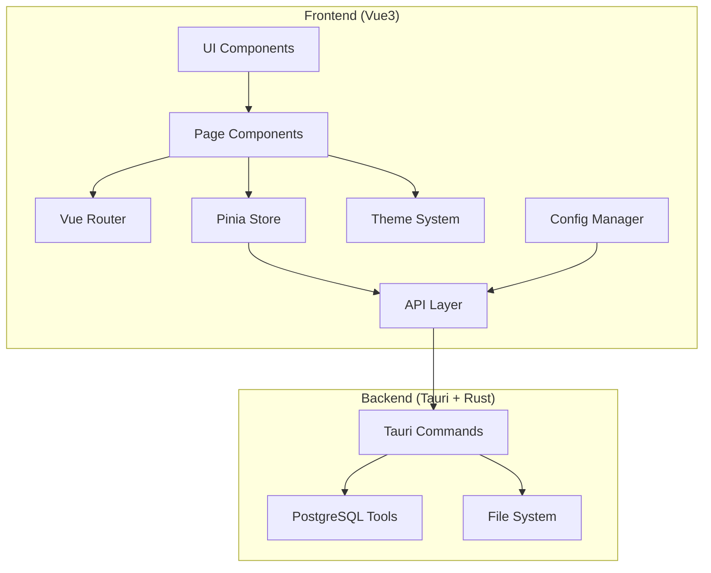

# Design Document: Vue3 Frontend Refactor

## Overview

本设计文档描述了将 PostgreSQL Database Tool 前端从 React 迁移到 Vue3 的技术方案。该重构将实现以下核心目标：

1. **技术栈现代化**：采用 Vue3 Composition API、TypeScript、Vue Router 和 Vite 构建工具
2. **模块化架构**：建立清晰的目录结构和组件层次
3. **功能增强**：添加主题系统、配置管理和数据库资源管理器
4. **用户体验提升**：提供现代化的 UI 和流畅的交互体验

该设计保持与现有 Tauri Rust 后端的完全兼容性，同时为未来的功能扩展提供坚实的基础。

## Architecture

### 整体架构



### 技术栈选择

**核心框架**：
- **Vue 3.4+**：使用 Composition API 和 `<script setup>` 语法
- **TypeScript 5.0+**：提供类型安全和更好的开发体验
- **Vite 5.0+**：快速的开发服务器和构建工具

**UI 组件库**：
- **Naive UI**：现代化、轻量级、TypeScript 友好的 Vue3 组件库
- 选择理由：
  - 完整的 TypeScript 支持
  - 优秀的主题定制能力
  - 丰富的组件生态
  - 良好的文档和社区支持

**状态管理**：
- **Pinia**：Vue3 官方推荐的状态管理库
- 用途：管理全局配置、主题状态、数据库连接状态

**路由管理**：
- **Vue Router 4**：Vue3 官方路由库

**工具库**：
- **@tauri-apps/api**：Tauri 前端 API
- **@tauri-apps/plugin-dialog**：文件对话框插件

### 目录结构设计

```
frontend/
├── src/
│   ├── assets/              # 静态资源
│   │   ├── styles/          # 全局样式
│   │   │   ├── variables.css    # CSS 变量
│   │   │   ├── themes.css       # 主题样式
│   │   │   └── global.css       # 全局样式
│   │   └── icons/           # 图标资源
│   │
│   ├── components/          # 通用组件
│   │   ├── common/          # 基础通用组件
│   │   │   ├── AppLayout.vue    # 应用布局
│   │   │   ├── AppHeader.vue    # 应用头部
│   │   │   ├── AppSidebar.vue   # 侧边栏导航
│   │   │   └── LoadingSpinner.vue
│   │   │
│   │   ├── database/        # 数据库相关组件
│   │   │   ├── DatabaseSelector.vue
│   │   │   ├── ConnectionSelector.vue
│   │   │   └── DatabaseList.vue
│   │   │
│   │   └── explorer/        # 资源管理器组件
│   │       ├── TableList.vue
│   │       ├── DataTable.vue
│   │       ├── RecordEditor.vue
│   │       └── RecordViewer.vue
│   │
│   ├── views/               # 页面组件
│   │   ├── Home.vue
│   │   ├── DatabaseExport.vue
│   │   ├── DatabaseImport.vue
│   │   ├── DatabaseExplorer.vue
│   │   └── Settings.vue
│   │
│   ├── api/                 # API 调用层
│   │   ├── types.ts         # API 类型定义
│   │   ├── database.ts      # 数据库相关 API
│   │   ├── config.ts        # 配置相关 API
│   │   └── explorer.ts      # 资源管理器 API
│   │
│   ├── stores/              # Pinia 状态管理
│   │   ├── theme.ts         # 主题状态
│   │   ├── config.ts        # 配置状态
│   │   └── database.ts      # 数据库状态
│   │
│   ├── composables/         # 组合式函数
│   │   ├── useTheme.ts      # 主题相关
│   │   ├── useConfig.ts     # 配置相关
│   │   └── useNotification.ts # 通知相关
│   │
│   ├── types/               # TypeScript 类型定义
│   │   ├── database.ts
│   │   ├── config.ts
│   │   └── common.ts
│   │
│   ├── utils/               # 工具函数
│   │   ├── storage.ts       # 本地存储
│   │   ├── validation.ts    # 表单验证
│   │   └── format.ts        # 格式化工具
│   │
│   ├── router/              # 路由配置
│   │   └── index.ts
│   │
│   ├── App.vue              # 根组件
│   └── main.ts              # 应用入口
│
├── public/                  # 公共资源
├── index.html
├── vite.config.ts
├── tsconfig.json
├── package.json
└── README.md
```

### 命名约定

**文件命名**：
- 组件文件：PascalCase（如 `AppLayout.vue`）
- 工具文件：camelCase（如 `storage.ts`）
- 类型文件：camelCase（如 `database.ts`）

**代码命名**：
- 组件名：PascalCase
- 函数名：camelCase
- 常量：UPPER_SNAKE_CASE
- 接口/类型：PascalCase

## Components and Interfaces

### 核心组件设计

#### 1. AppLayout（应用布局）

**职责**：提供应用的整体布局结构

**Props**：无

**结构**：
```vue
<template>
  <n-config-provider :theme="currentTheme">
    <n-layout has-sider>
      <AppSidebar />
      <n-layout>
        <AppHeader />
        <n-layout-content>
          <router-view />
        </n-layout-content>
      </n-layout>
    </n-layout>
  </n-config-provider>
</template>
```

#### 2. AppSidebar（侧边栏导航）

**职责**：提供页面导航菜单

**Props**：无

**功能**：
- 显示导航菜单项
- 高亮当前活动页面
- 响应路由变化

**导航项**：
- 首页（Home）
- 数据库导出（Export）
- 数据库导入（Import）
- 数据库资源管理器（Explorer）
- 配置（Settings）

#### 3. AppHeader（应用头部）

**职责**：显示应用标题和全局操作

**Props**：无

**功能**：
- 显示应用标题
- 主题切换按钮
- 服务器状态指示器

#### 4. ConnectionSelector（连接选择器）

**职责**：选择数据库连接配置

**Props**：
- `modelValue: string`：当前选中的连接 ID
- `showDefault: boolean`：是否显示默认连接标记

**Events**：
- `update:modelValue`：连接选择变化

**功能**：
- 显示所有可用连接配置
- 标记默认连接
- 支持快速切换

#### 5. DatabaseSelector（数据库选择器）

**职责**：选择特定连接下的数据库

**Props**：
- `connectionId: string`：连接配置 ID
- `modelValue: string`：当前选中的数据库名

**Events**：
- `update:modelValue`：数据库选择变化

**功能**：
- 加载并显示数据库列表
- 支持搜索过滤
- 显示加载状态

#### 6. DataTable（数据表格）

**职责**：以表格形式显示数据库表数据

**Props**：
- `connectionId: string`：连接配置 ID
- `database: string`：数据库名
- `table: string`：表名

**功能**：
- 分页显示数据
- 支持排序
- 行选择
- CRUD 操作按钮

#### 7. RecordEditor（记录编辑器）

**职责**：编辑或创建数据库记录

**Props**：
- `record: Record<string, any> | null`：要编辑的记录（null 表示新建）
- `columns: ColumnInfo[]`：列信息

**Events**：
- `save`：保存记录
- `cancel`：取消编辑

**功能**：
- 表单验证
- 类型适配（根据列类型显示不同输入控件）
- 错误提示

### API 接口设计

#### 类型定义

```typescript
// types/common.ts
export interface ApiResponse<T> {
  success: boolean;
  message: string;
  data?: T;
}

// types/config.ts
export interface DatabaseConnection {
  id: string;
  name: string;
  host: string;
  port: number;
  username: string;
  password: string;
  isDefault: boolean;
}

export interface AppConfig {
  connections: DatabaseConnection[];
  theme: 'light' | 'dark';
  defaultConnectionId?: string;
}

// types/database.ts
export interface DatabaseInfo {
  name: string;
  size?: string;
  tables?: number;
}

export interface TableInfo {
  name: string;
  schema: string;
  rowCount?: number;
}

export interface ColumnInfo {
  name: string;
  type: string;
  nullable: boolean;
  isPrimaryKey: boolean;
}

export interface TableData {
  columns: ColumnInfo[];
  rows: Record<string, any>[];
  totalRows: number;
  page: number;
  pageSize: number;
}
```

#### 前端 API 层

```typescript
// api/database.ts
export async function listDatabases(
  connectionId: string
): Promise<ApiResponse<string[]>>;

export async function exportDatabase(
  connectionId: string,
  database: string
): Promise<ApiResponse<string>>;

export async function importDatabase(
  connectionId: string,
  filePath: string,
  database: string
): Promise<ApiResponse<void>>;

// api/explorer.ts
export async function listTables(
  connectionId: string,
  database: string
): Promise<ApiResponse<TableInfo[]>>;

export async function getTableData(
  connectionId: string,
  database: string,
  table: string,
  page: number,
  pageSize: number
): Promise<ApiResponse<TableData>>;

export async function createRecord(
  connectionId: string,
  database: string,
  table: string,
  data: Record<string, any>
): Promise<ApiResponse<void>>;

export async function updateRecord(
  connectionId: string,
  database: string,
  table: string,
  primaryKey: Record<string, any>,
  data: Record<string, any>
): Promise<ApiResponse<void>>;

export async function deleteRecord(
  connectionId: string,
  database: string,
  table: string,
  primaryKey: Record<string, any>
): Promise<ApiResponse<void>>;

// api/config.ts
export async function loadConfig(): Promise<AppConfig>;

export async function saveConfig(config: AppConfig): Promise<void>;
```

#### 后端 API 扩展（需要新增的 Tauri Commands）

```rust
// 需要在 Rust 后端新增的命令

#[tauri::command]
async fn list_databases_with_connection(
    connection: DatabaseConnection
) -> Result<ApiResponse<Vec<String>>, String>;

#[tauri::command]
async fn export_database_with_connection(
    connection: DatabaseConnection,
    database: String
) -> Result<ApiResponse<String>, String>;

#[tauri::command]
async fn import_database_with_connection(
    connection: DatabaseConnection,
    file_path: String,
    database: String
) -> Result<ApiResponse<()>, String>;

#[tauri::command]
async fn list_tables(
    connection: DatabaseConnection,
    database: String
) -> Result<ApiResponse<Vec<TableInfo>>, String>;

#[tauri::command]
async fn get_table_data(
    connection: DatabaseConnection,
    database: String,
    table: String,
    page: u32,
    page_size: u32
) -> Result<ApiResponse<TableData>, String>;

#[tauri::command]
async fn create_record(
    connection: DatabaseConnection,
    database: String,
    table: String,
    data: serde_json::Value
) -> Result<ApiResponse<()>, String>;

#[tauri::command]
async fn update_record(
    connection: DatabaseConnection,
    database: String,
    table: String,
    primary_key: serde_json::Value,
    data: serde_json::Value
) -> Result<ApiResponse<()>, String>;

#[tauri::command]
async fn delete_record(
    connection: DatabaseConnection,
    database: String,
    table: String,
    primary_key: serde_json::Value
) -> Result<ApiResponse<()>, String>;
```

## Data Models

### 状态管理（Pinia Stores）

#### Theme Store

```typescript
// stores/theme.ts
import { defineStore } from 'pinia';
import { darkTheme, lightTheme } from 'naive-ui';

export const useThemeStore = defineStore('theme', {
  state: () => ({
    isDark: false,
  }),
  
  getters: {
    currentTheme: (state) => state.isDark ? darkTheme : lightTheme,
    themeName: (state) => state.isDark ? 'dark' : 'light',
  },
  
  actions: {
    toggleTheme() {
      this.isDark = !this.isDark;
      this.saveTheme();
    },
    
    setTheme(isDark: boolean) {
      this.isDark = isDark;
      this.saveTheme();
    },
    
    loadTheme() {
      const saved = localStorage.getItem('theme');
      if (saved) {
        this.isDark = saved === 'dark';
      }
    },
    
    saveTheme() {
      localStorage.setItem('theme', this.themeName);
    },
  },
});
```

#### Config Store

```typescript
// stores/config.ts
import { defineStore } from 'pinia';
import type { DatabaseConnection, AppConfig } from '@/types/config';
import { loadConfig, saveConfig } from '@/api/config';

export const useConfigStore = defineStore('config', {
  state: () => ({
    connections: [] as DatabaseConnection[],
    defaultConnectionId: undefined as string | undefined,
  }),
  
  getters: {
    defaultConnection: (state) => {
      return state.connections.find(c => c.id === state.defaultConnectionId);
    },
    
    getConnectionById: (state) => {
      return (id: string) => state.connections.find(c => c.id === id);
    },
  },
  
  actions: {
    async loadConfig() {
      const config = await loadConfig();
      this.connections = config.connections;
      this.defaultConnectionId = config.defaultConnectionId;
    },
    
    async saveConfig() {
      await saveConfig({
        connections: this.connections,
        theme: 'light', // 由 theme store 管理
        defaultConnectionId: this.defaultConnectionId,
      });
    },
    
    addConnection(connection: DatabaseConnection) {
      this.connections.push(connection);
      this.saveConfig();
    },
    
    updateConnection(id: string, updates: Partial<DatabaseConnection>) {
      const index = this.connections.findIndex(c => c.id === id);
      if (index !== -1) {
        this.connections[index] = { ...this.connections[index], ...updates };
        this.saveConfig();
      }
    },
    
    deleteConnection(id: string) {
      this.connections = this.connections.filter(c => c.id !== id);
      if (this.defaultConnectionId === id) {
        this.defaultConnectionId = undefined;
      }
      this.saveConfig();
    },
    
    setDefaultConnection(id: string) {
      this.defaultConnectionId = id;
      this.saveConfig();
    },
  },
});
```

#### Database Store

```typescript
// stores/database.ts
import { defineStore } from 'pinia';

export const useDatabaseStore = defineStore('database', {
  state: () => ({
    currentConnectionId: undefined as string | undefined,
    currentDatabase: undefined as string | undefined,
    databases: [] as string[],
    isLoading: false,
  }),
  
  actions: {
    setCurrentConnection(id: string) {
      this.currentConnectionId = id;
      this.currentDatabase = undefined;
      this.databases = [];
    },
    
    setCurrentDatabase(name: string) {
      this.currentDatabase = name;
    },
    
    setDatabases(databases: string[]) {
      this.databases = databases;
    },
    
    setLoading(loading: boolean) {
      this.isLoading = loading;
    },
  },
});
```

### 本地存储结构

配置文件存储在用户目录下：`~/.pg-db-tool/config.json`

```json
{
  "connections": [
    {
      "id": "uuid-1",
      "name": "本地开发",
      "host": "localhost",
      "port": 5432,
      "username": "postgres",
      "password": "encrypted_password",
      "isDefault": true
    },
    {
      "id": "uuid-2",
      "name": "测试服务器",
      "host": "192.168.1.100",
      "port": 5432,
      "username": "testuser",
      "password": "encrypted_password",
      "isDefault": false
    }
  ],
  "theme": "dark",
  "defaultConnectionId": "uuid-1"
}
```

### 路由配置

```typescript
// router/index.ts
import { createRouter, createWebHistory } from 'vue-router';

const routes = [
  {
    path: '/',
    name: 'Home',
    component: () => import('@/views/Home.vue'),
  },
  {
    path: '/export',
    name: 'Export',
    component: () => import('@/views/DatabaseExport.vue'),
  },
  {
    path: '/import',
    name: 'Import',
    component: () => import('@/views/DatabaseImport.vue'),
  },
  {
    path: '/explorer',
    name: 'Explorer',
    component: () => import('@/views/DatabaseExplorer.vue'),
  },
  {
    path: '/settings',
    name: 'Settings',
    component: () => import('@/views/Settings.vue'),
  },
];

export const router = createRouter({
  history: createWebHistory(),
  routes,
});
```

## Correctness Properties

*属性（Property）是关于系统行为的形式化陈述，应该在所有有效执行中保持为真。属性是人类可读规范和机器可验证正确性保证之间的桥梁。*

### Property 1: API 兼容性

*对于任何* Tauri 后端 API 调用，前端应该使用与后端期望的参数格式和类型完全匹配的参数，并且应该正确处理返回的 ApiResponse 类型

**Validates: Requirements 2.3**

### Property 2: 主题持久化往返

*对于任何* 主题选择（亮色或暗色），保存到本地存储后再加载应该得到相同的主题设置

**Validates: Requirements 3.3, 3.4**

### Property 3: 配置 CRUD 操作一致性

*对于任何* 数据库连接配置，执行创建、更新或删除操作后，配置列表应该正确反映这些变化，并且本地配置文件应该包含最新的配置数据

**Validates: Requirements 6.2, 6.3, 6.4, 6.5**

### Property 4: 默认连接传播

*对于任何* 被设置为默认的连接配置，所有需要连接配置的页面（导出、导入、资源管理器）应该自动选择该连接

**Validates: Requirements 6.8**

### Property 5: 配置加载完整性

*对于任何* 保存到本地配置文件的配置集合，应用启动时加载的配置应该与保存的配置完全一致

**Validates: Requirements 6.9, 11.4**

### Property 6: 数据库列表响应性

*对于任何* 连接配置选择，前端应该调用相应的 API 并显示返回的数据库列表

**Validates: Requirements 4.3, 5.2, 7.2**

### Property 7: 导出操作完整性

*对于任何* 有效的数据库导出请求，前端应该调用正确的后端 API，并在操作完成后显示包含文件路径的结果消息

**Validates: Requirements 4.4, 4.5**

### Property 8: 导入操作完整性

*对于任何* 有效的数据库导入请求（包含文件路径和目标数据库名），前端应该调用正确的后端 API，并在操作完成后显示结果消息

**Validates: Requirements 5.5, 5.6**

### Property 9: 表数据 CRUD 往返

*对于任何* 表记录，执行创建、更新或删除操作后，重新查询表数据应该反映这些变化

**Validates: Requirements 7.6, 7.8, 7.9, 7.11**

### Property 10: 分页数据一致性

*对于任何* 表的分页查询，返回的数据应该包含正确的页码、页大小和总行数信息

**Validates: Requirements 7.5**

### Property 11: 路由导航正确性

*对于任何* 导航菜单项的点击，应该导航到对应的路由路径，并且当前路由对应的导航项应该被高亮显示

**Validates: Requirements 8.3, 8.4**

### Property 12: 错误处理一致性

*对于任何* 失败的 API 调用，前端应该捕获错误并显示用户友好的错误消息

**Validates: Requirements 10.1, 10.5**

### Property 13: 加载状态可见性

*对于任何* 异步操作（API 调用），在操作进行中应该显示加载指示器，操作完成后应该隐藏加载指示器

**Validates: Requirements 10.2**

### Property 14: 成功反馈一致性

*对于任何* 成功完成的操作（导出、导入、CRUD），前端应该显示成功提示消息

**Validates: Requirements 10.3**

### Property 15: 表单验证反馈

*对于任何* 包含无效输入的表单提交，前端应该阻止提交并显示具体的验证错误信息

**Validates: Requirements 10.4**

### Property 16: 配置数据格式正确性

*对于任何* 保存到本地的配置数据，文件内容应该是有效的 JSON 格式，并且应该符合 AppConfig 类型定义

**Validates: Requirements 11.5**

### Property 17: 后端 API 数据库列表正确性

*对于任何* 有效的连接配置，后端 API 应该返回该连接下所有非模板数据库的列表

**Validates: Requirements 12.1**

### Property 18: 后端 API 表列表正确性

*对于任何* 有效的数据库，后端 API 应该返回该数据库中所有表的列表，包括表的模式信息

**Validates: Requirements 12.2**

### Property 19: 后端 API 分页查询正确性

*对于任何* 有效的表和分页参数，后端 API 应该返回正确的数据子集和分页元数据

**Validates: Requirements 12.3**

### Property 20: 后端 API CRUD 操作正确性

*对于任何* 有效的 CRUD 操作请求（创建、更新、删除），后端 API 应该成功执行操作并返回成功的 ApiResponse

**Validates: Requirements 12.4, 12.5, 12.6**

### Property 21: 后端 API 连接配置支持

*对于任何* 数据库操作 API，应该接受连接配置参数并使用该配置执行操作

**Validates: Requirements 12.7**

### Property 22: 后端 API 错误响应格式

*对于任何* 失败的 API 调用，后端应该返回包含 success=false 和错误详情的 ApiResponse

**Validates: Requirements 12.8**

## Error Handling

### 前端错误处理策略

#### 1. API 调用错误

**错误类型**：
- 网络连接失败
- 后端服务不可用
- API 返回错误响应
- 超时错误

**处理方式**：
```typescript
// api/base.ts
export async function invokeCommand<T>(
  command: string,
  args?: Record<string, any>
): Promise<ApiResponse<T>> {
  try {
    const response = await invoke<ApiResponse<T>>(command, args);
    return response;
  } catch (error) {
    console.error(`API call failed: ${command}`, error);
    
    // 转换为统一的错误响应
    return {
      success: false,
      message: error instanceof Error ? error.message : '未知错误',
      data: undefined,
    };
  }
}
```

**用户反馈**：
- 使用 Naive UI 的 `notification` 组件显示错误消息
- 错误消息应该清晰、具体、可操作
- 提供重试选项（如果适用）

#### 2. 表单验证错误

**验证规则**：
```typescript
// utils/validation.ts
export const connectionValidationRules = {
  name: {
    required: true,
    message: '请输入连接名称',
  },
  host: {
    required: true,
    message: '请输入主机地址',
  },
  port: {
    required: true,
    type: 'number',
    message: '请输入有效的端口号',
  },
  username: {
    required: true,
    message: '请输入用户名',
  },
};
```

**处理方式**：
- 使用 Naive UI 的表单验证功能
- 实时验证（失去焦点时）
- 提交前完整验证
- 显示具体的字段错误信息

#### 3. 数据加载错误

**场景**：
- 配置文件损坏或格式错误
- 本地存储不可用
- 数据解析失败

**处理方式**：
```typescript
// utils/storage.ts
export async function loadConfig(): Promise<AppConfig> {
  try {
    const configStr = localStorage.getItem('app-config');
    if (!configStr) {
      return getDefaultConfig();
    }
    
    const config = JSON.parse(configStr);
    // 验证配置结构
    if (!isValidConfig(config)) {
      console.warn('Invalid config structure, using default');
      return getDefaultConfig();
    }
    
    return config;
  } catch (error) {
    console.error('Failed to load config', error);
    return getDefaultConfig();
  }
}
```

#### 4. 运行时错误

**全局错误处理**：
```typescript
// main.ts
app.config.errorHandler = (err, instance, info) => {
  console.error('Global error:', err, info);
  
  // 显示用户友好的错误消息
  window.$notification?.error({
    title: '应用错误',
    content: '发生了意外错误，请刷新页面重试',
    duration: 5000,
  });
};
```

### 后端错误处理策略

#### 1. 数据库连接错误

**错误类型**：
- 连接超时
- 认证失败
- 数据库不存在
- 权限不足

**处理方式**：
```rust
fn handle_db_error(error: &str) -> String {
    if error.contains("timeout") {
        "数据库连接超时，请检查网络连接".to_string()
    } else if error.contains("authentication") {
        "认证失败，请检查用户名和密码".to_string()
    } else if error.contains("does not exist") {
        "数据库不存在".to_string()
    } else if error.contains("permission denied") {
        "权限不足，请检查用户权限".to_string()
    } else {
        format!("数据库错误: {}", error)
    }
}
```

#### 2. 文件操作错误

**错误类型**：
- 文件不存在
- 权限不足
- 磁盘空间不足
- 文件格式错误

**处理方式**：
- 在操作前验证文件存在性
- 检查文件权限
- 提供清晰的错误消息
- 记录详细的错误日志

#### 3. PostgreSQL 工具错误

**错误类型**：
- pg_dump/pg_restore 不可用
- 命令执行失败
- 备份文件损坏

**处理方式**：
- 在应用启动时检查工具可用性
- 捕获命令输出和错误信息
- 提供安装指导（如果工具缺失）

## Testing Strategy

### 测试方法论

本项目采用**双重测试策略**：

1. **单元测试**：验证特定示例、边缘情况和错误条件
2. **属性测试**：验证跨所有输入的通用属性

这两种测试方法是互补的，共同提供全面的测试覆盖：
- 单元测试捕获具体的错误
- 属性测试验证一般正确性

### 前端测试

#### 测试框架

- **Vitest**：快速的单元测试框架
- **@vue/test-utils**：Vue 组件测试工具
- **fast-check**：TypeScript 属性测试库

#### 单元测试重点

**组件测试**：
```typescript
// tests/components/ConnectionSelector.spec.ts
describe('ConnectionSelector', () => {
  it('should display all connections', () => {
    // 测试连接列表显示
  });
  
  it('should mark default connection', () => {
    // 测试默认连接标记
  });
  
  it('should emit update event on selection', () => {
    // 测试选择事件
  });
});
```

**Store 测试**：
```typescript
// tests/stores/config.spec.ts
describe('ConfigStore', () => {
  it('should add new connection', () => {
    // 测试添加连接
  });
  
  it('should update existing connection', () => {
    // 测试更新连接
  });
  
  it('should delete connection', () => {
    // 测试删除连接
  });
});
```

**API 测试**：
```typescript
// tests/api/database.spec.ts
describe('Database API', () => {
  it('should call correct Tauri command', () => {
    // 测试 API 调用
  });
  
  it('should handle API errors', () => {
    // 测试错误处理
  });
});
```

#### 属性测试配置

**配置要求**：
- 每个属性测试至少运行 100 次迭代
- 使用 fast-check 生成随机测试数据
- 每个测试必须引用设计文档中的属性

**标签格式**：
```typescript
// Feature: vue3-frontend-refactor, Property 3: 配置 CRUD 操作一致性
test('config CRUD operations maintain consistency', () => {
  fc.assert(
    fc.property(
      fc.record({
        id: fc.uuid(),
        name: fc.string(),
        host: fc.string(),
        port: fc.integer({ min: 1, max: 65535 }),
        username: fc.string(),
        password: fc.string(),
      }),
      (connection) => {
        // 测试配置 CRUD 操作
      }
    ),
    { numRuns: 100 }
  );
});
```

### 后端测试

#### 测试框架

- **Rust 内置测试框架**
- **proptest**：Rust 属性测试库
- **mockall**：模拟库（用于模拟数据库连接）

#### 单元测试重点

**API 命令测试**：
```rust
#[cfg(test)]
mod tests {
    use super::*;
    
    #[tokio::test]
    async fn test_list_databases() {
        // 测试数据库列表 API
    }
    
    #[tokio::test]
    async fn test_export_database() {
        // 测试导出 API
    }
}
```

**错误处理测试**：
```rust
#[tokio::test]
async fn test_invalid_connection() {
    // 测试无效连接处理
}

#[tokio::test]
async fn test_missing_database() {
    // 测试数据库不存在处理
}
```

#### 属性测试示例

```rust
use proptest::prelude::*;

proptest! {
    // Feature: vue3-frontend-refactor, Property 17: 后端 API 数据库列表正确性
    #[test]
    fn test_list_databases_returns_valid_list(
        host in ".*",
        port in 1u16..65535u16,
    ) {
        // 测试数据库列表返回有效数据
    }
}
```

### 集成测试

**端到端流程测试**：
1. 配置管理流程：创建 → 保存 → 加载 → 使用
2. 导出流程：选择连接 → 选择数据库 → 导出 → 验证文件
3. 导入流程：选择连接 → 选择文件 → 导入 → 验证数据
4. 资源管理器流程：选择连接 → 选择数据库 → 选择表 → CRUD 操作

**测试环境**：
- 使用 Docker 运行测试 PostgreSQL 实例
- 准备测试数据集
- 清理测试数据

### 测试覆盖率目标

- **单元测试覆盖率**：> 80%
- **关键路径覆盖率**：100%
- **属性测试**：所有设计文档中的属性都应该有对应的测试

### 持续集成

**CI 流程**：
1. 代码检查（ESLint、Prettier）
2. 类型检查（TypeScript）
3. 单元测试
4. 属性测试
5. 集成测试
6. 构建验证

**测试命令**：
```json
{
  "scripts": {
    "test": "vitest run",
    "test:watch": "vitest",
    "test:coverage": "vitest run --coverage",
    "test:property": "vitest run --grep 'Property'",
    "test:e2e": "vitest run --grep 'E2E'"
  }
}
```

