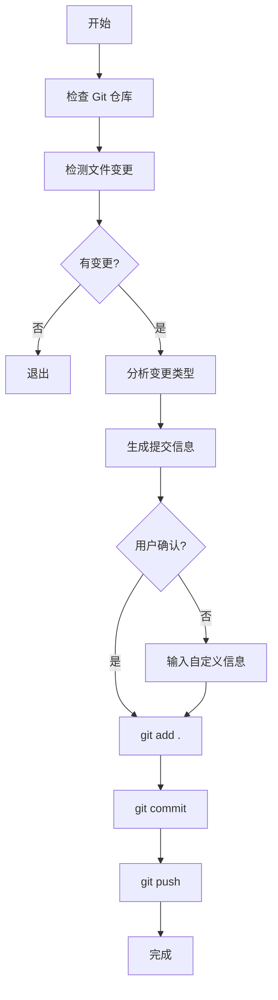

# MyGit - 智能 Git 自动化工作流

> 使用 AI 自动生成提交信息，一键提交并推送到远程仓库

## ✨ 特性

- 🤖 **AI 智能生成** - 根据文件变更自动生成符合规范的提交信息
- 📝 **约定式提交** - 遵循 Conventional Commits 规范
- 🚀 **一键操作** - 自动完成 add、commit、push 全流程
- 🔍 **变更分析** - 智能分析文件类型和变更范围
- 👀 **预览模式** - 支持预览将要执行的操作
- 🎨 **彩色输出** - 清晰的命令行界面
- 🔧 **灵活配置** - 支持自定义提交信息、分支、远程仓库

## 📦 文件说明

| 文件 | 说明 | 推荐 |
|------|------|------|
| `mygit.ts` | Bun/TypeScript 版本（跨平台） | ⭐⭐⭐ |
| `mygit.ps1` | Windows PowerShell 版本 | ⭐⭐ |
| `mygit.sh` | Linux/macOS Bash 版本 | ⭐⭐ |
| `MYGIT_QUICKSTART.md` | 快速开始指南 | - |
| `MYGIT_USAGE.md` | 完整使用文档 | - |
| `MYGIT_README.md` | 本文件 | - |

## 🚀 快速开始

### 推荐方式：使用 Bun（跨平台）⭐

```bash
# 基本用法
bun run mygit

# 自定义提交信息
bun run mygit "feat: 添加新功能"

# 预览模式
bun run mygit --dry-run

# 指定分支
bun run mygit --branch develop
```

### Windows (PowerShell)

```powershell
# 运行脚本
.\mygit.ps1

# 预览模式
.\mygit.ps1 -DryRun
```

### Linux/macOS (Bash)

```bash
# 添加执行权限
chmod +x mygit.sh

# 运行脚本
./mygit.sh

# 预览模式
./mygit.sh --dry-run
```

## 📖 使用示例

### 基本用法（推荐使用 Bun）

```bash
# 自动生成提交信息
bun run mygit

# 输出示例：
# ℹ === Git 自动化工作流 ===
# ✓ Git 仓库检查通过
# ✓ 检测到文件变更
# ℹ 变更文件数: 8
# 
# ✓ AI 生成的提交信息:
# test(tests): 完善测试覆盖率
# 
# 变更文件数: 8
# 
# 是否使用此提交信息？(Y/n):
```

### 自定义提交信息

```bash
bun run mygit "feat: 添加用户登录功能"
```

### 指定分支

```bash
bun run mygit --branch develop
```

### 预览模式

```bash
bun run mygit --dry-run
```

### 组合参数

```bash
bun run mygit "fix: 修复bug" --branch develop --dry-run
```

## 🎯 AI 生成规则

脚本会根据文件变更智能判断提交类型：

### 提交类型映射

| 文件类型 | 提交类型 | 范围 | 示例 |
|---------|---------|------|------|
| 测试文件 (test/spec) | `test` | `tests` | `test(tests): 完善测试覆盖率` |
| 文档文件 (.md) | `docs` | - | `docs: 更新文档` |
| 前端文件 (frontend/) | `feat` | `frontend` | `feat(frontend): 更新前端功能` |
| 后端文件 (src-tauri/) | `feat` | `backend` | `feat(backend): 更新后端功能` |
| 前后端都有 | `feat` | `fullstack` | `feat(fullstack): 更新前后端功能` |
| 配置文件 (.json/.toml) | `chore` | `config` | `chore(config): 更新配置文件` |

### 约定式提交格式

```
<类型>(<范围>): <描述>

变更文件数: X
```

## 🔧 参数说明

### PowerShell 版本 (mygit.ps1)

| 参数 | 类型 | 说明 | 默认值 |
|------|------|------|--------|
| `-Message` | String | 自定义提交信息 | AI 生成 |
| `-Branch` | String | 目标分支 | 当前分支 |
| `-Remote` | String | 远程仓库名称 | origin |
| `-DryRun` | Switch | 预览模式 | false |

### Bash 版本 (mygit.sh)

| 参数 | 说明 | 默认值 |
|------|------|--------|
| 第一个参数 | 自定义提交信息 | AI 生成 |
| `--branch <name>` | 目标分支 | 当前分支 |
| `--remote <name>` | 远程仓库名称 | origin |
| `--dry-run` | 预览模式 | false |

## 📊 工作流程



## 🎨 输出示例

### 成功执行

```
ℹ === Git 自动化工作流 ===

✓ Git 仓库检查通过
ℹ 当前分支: main
ℹ 目标分支: main
ℹ 远程仓库: origin

✓ 检测到文件变更
ℹ 变更文件数: 8

ℹ 变更摘要:
- [新增] frontend/test/setup.ts
- [新增] frontend/bunfig.toml
- [修改] frontend/src/utils/storage.ts
- [新增] frontend/TESTING.md

✓ AI 生成的提交信息:
test(tests): 完善测试覆盖率

变更文件数: 8

是否使用此提交信息？(Y/n): Y

ℹ === 开始执行 Git 操作 ===

ℹ 步骤 1/3: 添加所有更改...
✓ 已添加所有更改
ℹ 步骤 2/3: 提交更改...
✓ 提交成功
ℹ 步骤 3/3: 推送到远程仓库...
✓ 推送成功

✓ === 所有操作完成 ===
ℹ 提交信息: test(tests): 完善测试覆盖率
ℹ 分支: main
ℹ 远程: origin
```

### 预览模式

```
⚠ === 预览模式 - 不会执行实际操作 ===
ℹ 将执行以下操作:
  1. git add .
  2. git commit -m "test(tests): 完善测试覆盖率"
  3. git push origin main
```

## 🛠️ 故障排除

### Windows: 无法运行脚本

**问题**: 提示"无法加载文件，因为在此系统上禁止运行脚本"

**解决方案**:
```powershell
Set-ExecutionPolicy -ExecutionPolicy RemoteSigned -Scope CurrentUser
```

### Linux/macOS: 权限不足

**问题**: 提示"Permission denied"

**解决方案**:
```bash
chmod +x mygit.sh
```

### 推送失败

**问题**: 推送到远程仓库失败

**检查清单**:
1. 检查网络连接
2. 检查远程仓库配置: `git remote -v`
3. 检查推送权限
4. 测试连接: `git fetch origin`

### 没有检测到变更

**问题**: 提示"没有检测到任何变更"

**检查清单**:
1. 确保文件已保存
2. 检查文件是否在 .gitignore 中
3. 运行 `git status` 查看状态

## 📚 文档索引

- **快速开始**: `MYGIT_QUICKSTART.md` - 一分钟上手
- **完整文档**: `MYGIT_USAGE.md` - 详细使用说明
- **本文档**: `MYGIT_README.md` - 项目概览

## 🔗 相关资源

- [Conventional Commits](https://www.conventionalcommits.org/) - 约定式提交规范
- [Git 文档](https://git-scm.com/doc) - Git 官方文档
- [PowerShell 文档](https://docs.microsoft.com/powershell/) - PowerShell 官方文档

## 💡 最佳实践

1. **首次使用先预览**
   ```powershell
   .\mygit.ps1 -DryRun
   ```

2. **小步提交**
   - 频繁提交小的、逻辑相关的变更
   - 避免一次提交大量不相关的变更

3. **有意义的提交信息**
   - 即使使用 AI 生成，也要确保信息准确
   - 必要时修改或自定义提交信息

4. **定期推送**
   - 不要在本地积累太多提交
   - 定期推送到远程仓库

5. **分支管理**
   - 在功能分支上开发
   - 完成后合并到主分支

## 🚀 高级用法

### 集成到 Git 别名

```bash
# 添加到 ~/.gitconfig
[alias]
    mygit = "!pwsh -File ./mygit.ps1"
    
# 使用
git mygit
```

### 集成到 VS Code

在 `.vscode/tasks.json` 中添加：
```json
{
    "version": "2.0.0",
    "tasks": [
        {
            "label": "MyGit: 自动提交",
            "type": "shell",
            "command": "pwsh",
            "args": ["-File", "${workspaceFolder}/mygit.ps1"],
            "problemMatcher": []
        }
    ]
}
```

## 🤝 贡献

欢迎提交 Issue 和 Pull Request！

## 📄 许可证

MIT License

---

**让 Git 提交变得简单高效！** 🎉
